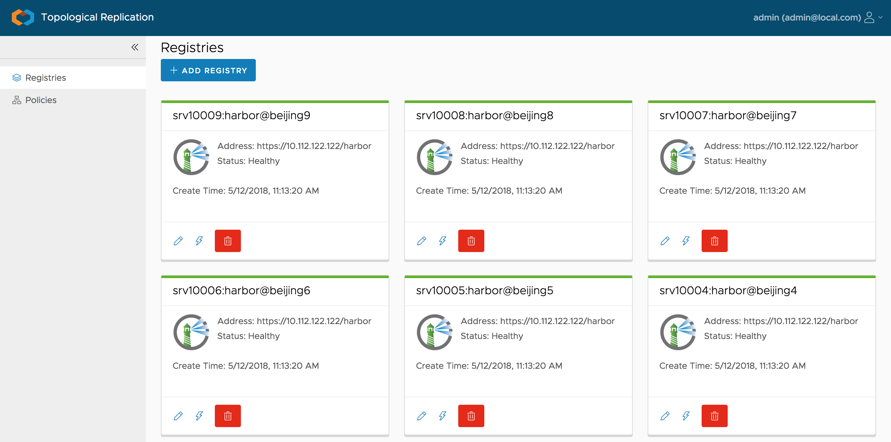
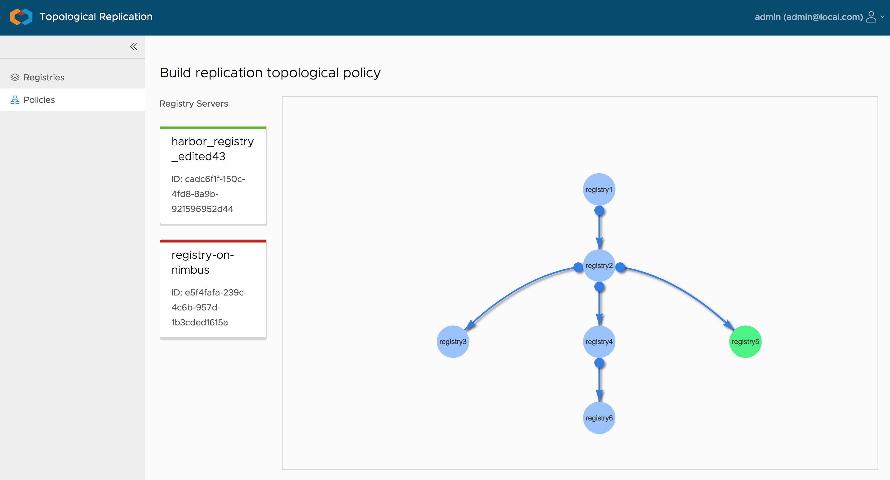

# Octopus


Project **octopus** is incubated from and built on the popular open source project **[Harbor](https://github.com/vmware/harbor)**, which is an enterprise-class registry server that stores and distributes container images. 

Project **octopus** is designed to replicate container images between multiple image registry instances which are located in different sites/datacenters with visual topological structured policy.

**Limitation:** Currently, it only supports Harbor instances. In future, it will support more registry types like `DockerHub` etc.

**Project Status: Incubating**

## Main features
The project **octopus** provides the following main features:
* Web console
* Manage multiple Harbor instances with health status checking
* Provide an orchestrating builder to design the topological replication policy among multiple instances
* Monitor the replication status with a unified view
* Provide replication statistics

## Screenshots
Registry management:


Topological policy orchestrate:


## Contributors
**Originator:** [Steven Zou](mailto:szou@vmware.com)

**Contributors**:
* [Steven Zou](mailto:szou@vmware.com)
* [Wen Kai Yin](mailto:yinw@vmware.com)

## How to run

### Start the API server
```
cd server

#~/tmp/database is the database file path
go run main.go -f ~/tmp/database

#For default, the server is started at host with port 7878
```

### Start web console
```
npm install

```


Before starting the web server, please find the file `index.d.ts` under folder `node_modules/@types/vis` and update the following interface (line 1699)

```
export interface Edge {
  from?: IdType;
  to?: IdType;
  id?: IdType;
}
```

to

```
export interface Edge {
  from?: IdType;
  to?: IdType;
  id?: IdType;
  label?: string;
}
```

```
#If the api server is started at other host, please
#update the file 'proxy.config.json' to let it point
#to the right backend API server

npm start
```

### Browse
Open your browser, access `http://localhost:4200`